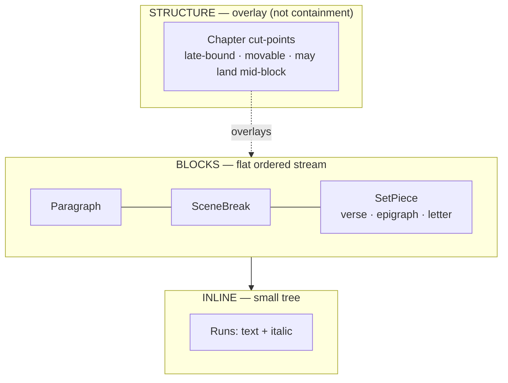
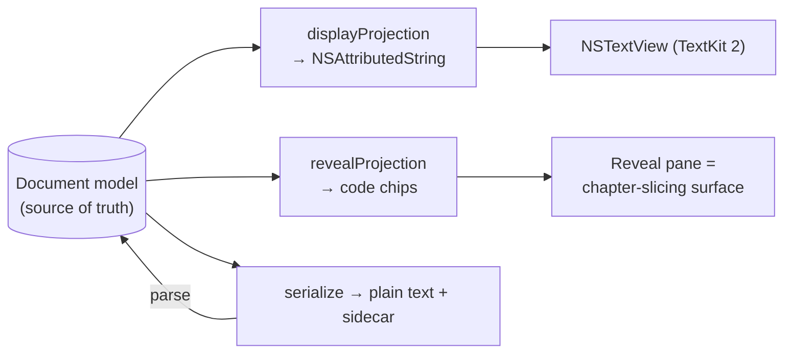

# Technical Design — Untitled

> *Named for the state every manuscript starts in.*

**A distraction-first writing tool for long-form prose, with WordPerfect-style reveal codes.**

| | |
|---|---|
| Status | Draft / design exploration |
| Platform | macOS (Mac-first) |
| Model | For-fun, open source, donation-funded |
| Date | 2026-06-05 |

---

## 1. What it is

A native Mac writing tool that gives a novelist **WordPerfect typing simplicity** and a **Reveal Codes truth-toggle**, and nothing else. You type; the manuscript comes out correctly formatted; you never touch a font or a margin. When something looks wrong, you flip on Reveal and see the literal codes in your document — addressable objects you can delete.

It is deliberately the **anti-Scrivener**: not a project-management cockpit, but a typewriter that happens to be smart and happens to disappear. The buyer is the writer who found that managing Scrivener became a second job and just wants to write and trust the machine.

### Guiding principle

> **Model the domain, derive the presentation. The model is the truth; every view is a projection of it. The tool has no opinion about the writing — it handles the mechanics flawlessly and silently.**

This is the same principle WordPerfect's stream and Fade In's element model share: the writer thinks only in domain objects (scene, verse, chapter), and typography is computed downstream. The constraint — a tiny, closed vocabulary — is the feature, not a limitation.

---

## 2. Non-goals

These are load-bearing. The death of a tool like this is scope creep.

- **No cockpit.** No corkboard, no metadata grids, no compile dialog with forty options.
- **No AI co-author.** No continuity-checking, no generation, no "Save the Cat" structure coaching. Reference lookup is mechanical (a fuzzy index), never editorial.
- **No rich formatting.** No fonts, sizes, colors, styles, bold, underline. Italic is the only inline mark in v1.
- **No collaboration / cloud / sync in v1.** Local files the writer owns.
- **No Windows / iPad in v1.** Mac-first. (See ADR-002 for the extraction path if this ever changes.)

---

## 3. Architecture overview

The whole product is, by weight, ~90% a text-editing engine. Everything delightful — auto-indent, the reveal toggle, peek overlays, the `@`-bible — rides on the editing surface. That fact drives every platform and model decision below.

The document is modeled in **three layers**, and the structural layer is intentionally a *stream*, not a tree.



- **Inline layer** — a small tree. A run is text plus marks; italic is the only mark.
- **Block layer** — a flat, ordered sequence (a stream). Paragraph, SceneBreak, and SetPiece blocks.
- **Structure layer (chapters)** — *not* a container. Chapters are a separate, movable overlay of cut-points that reference positions in the block stream.

Why the structural layer is a stream-overlay rather than a tree is the central decision of the whole design; see §6 and ADR-005.

---

## 4. Domain model

Expressed in Swift (the recommended core language; trivially portable to Rust if ADR-002 is ever exercised). This is the source of truth — **not** an `NSAttributedString`.

```swift
// ── Inline layer ──────────────────────────────────────────────
// A run is text plus marks. Italic is the only mark in v1.
struct Run {
    var text: String
    var italic: Bool = false
}

// ── Block layer ───────────────────────────────────────────────
// A flat, ordered sequence. No containment, no nesting.
enum Block {
    case paragraph(runs: [Run])
    case sceneBreak                                   // the "* * *" ornament
    case setPiece(kind: SetPieceKind, lines: [[Run]]) // verse/epigraph/letter
}

// Each kind derives its own presentation (alignment, italics, spacing).
// `lines` are preserved hard breaks — see §7.
enum SetPieceKind { case verse, epigraph, letter }

// ── Structure layer ───────────────────────────────────────────
// Chapters are an OVERLAY of cut-points, not containers.
struct ChapterCut {
    var beforeBlock: Int        // index into Document.blocks
    var offsetInBlock: Int?     // nil = block boundary; set = mid-block cut "at the peak"
    var title: String?          // optional, set when you commit the boundary
    var opener: TemplateRef?    // chapter-opener pattern, applied at the cut (§9)
}

// ── Document ──────────────────────────────────────────────────
struct Document {
    var blocks: [Block]         // the continuous draft — the thing you write
    var cuts:   [ChapterCut]    // the late-bound chapter overlay, sorted by position
    var bible:  Bible           // reference index (§9)
    var meta:   Metadata
}
```

Two things to notice in the types:

1. `offsetInBlock` encodes the writer's core device directly: a chapter cut can land **inside** a block, at an emotional peak, because chapters are annotations over a continuous text rather than containers carved at logical seams.
2. There is no `Chapter` *struct that owns blocks*. A chapter is computed at render time by walking the block stream and splicing at the cut-points.

---

## 5. The two projections

Reveal Codes is nearly free in this model because the document has nothing hidden: the model **is** the truth, and the two views are two pure functions over it.

```swift
// Codes → formatting, rendered invisible. The clean reading view.
func displayProjection(_ doc: Document) -> NSAttributedString

// Codes → visible chips. The truth view.
func revealProjection(_ doc: Document) -> [RevealToken]

enum RevealToken {
    case text(String)
    case code(label: String, id: CodeID)   // [Verse] [/Verse] [line] [SceneBreak] [Chapter]
}
```



Because both views derive from one model, they can never disagree — which was the entire reason Reveal Codes worked in WordPerfect, and the reason it's cheap here.

---

## 6. Chapters as a movable overlay (the central decision)

Every other tool — Scrivener, Ulysses, Word's outline — makes chapters **contain** scenes: a tree. This product's defining writer-device makes that wrong.

The writer drafts continuous logical units, then **slices later**, cutting chapters at emotional/action peaks that deliberately *do not* align with the logical seams — the cliffhanger illusion that keeps a reader turning pages. A containment tree cannot express a boundary that crosses its own contents.

So:

- You draft a **continuous stream of scenes** with no chapters at all. Chapters never appear while drafting.
- Later you **"operate" on the text**: lay cut-points over the stream and drag them. A cut may land mid-block.
- Render walks the stream; each time it crosses a cut-point it begins a chapter — page break, number, and the opener template from §9.

And the elegant convergence: **a chapter cut is just a `[Chapter Break]` code in the reveal view.** Your "slice it later" pass *is* the Reveal Codes view in chapter-editing mode. The surface built to debug formatting is the surface you carve the book with.

This is also why the structural layer is modeled as a stream-overlay and not a tree — the writer's own habits cast the deciding vote in the stream-vs-tree debate.

---

## 7. Set-pieces and newline semantics

The centered italic verse is the first real addition to the vocabulary, and it earns its place because it isn't merely "centered italic" — it has **different newline rules**.

- In a **Paragraph**, Enter ends the paragraph (`[HRt]`). Text soft-wraps.
- In a **SetPiece** (verse/epigraph/letter), Enter inserts a **preserved line break** (`[line]`) that survives to print — `"and the cat came back"` stays its own line.

The writer marks a block as `verse` once; centered + italic + line-preservation are **derived from the kind**, never hand-set. The escape hatch (a one-off left-aligned poem) is a per-block presentation override, used rarely.

In Reveal, a set-piece reads:

```
[Verse]
Half a league, half a league,[line]
Half a league onward,[line]
[/Verse]
```

— with `[line]` codes you can see and delete.

---

## 8. Typing simplicity (input layer)

These behaviors live in the text view's input hooks, operating on the model. The writer never invokes them deliberately; they just happen.

- **Enter** → new paragraph with the correct first-line indent, derived. First paragraph of a scene/chapter comes out un-indented, per convention.
- **Italic** → `Cmd-I` or `_word_`. The only inline mark.
- **Scene break** → typing `#` or `***` on an empty line becomes the ornament; the model stores a `sceneBreak` block. Reveal shows `[SceneBreak]`.
- **Smart typography** → straight quotes → curly, `--` → em dash, `...` → ellipsis, as you type.
- **Set-piece entry** → a single toggle puts you "in verse"; Enter then means `[line]` until you exit.

No soft-return (`[SRt]`) is modeled — layout wrapping is TextKit's job, kept out of the content. (See Open Questions.)

---

## 9. Reference system — peek, bible, scene memory

The constraint: reference must be a **peek, not a navigation.** The lookup is cheap; getting *back* into the scene is expensive. Any shortcut that moves the cursor or scroll has failed. Bar: hands on home row, cursor pinned, reference gone the instant you stop looking.

**Peek** — a read-only overlay (`NSPopover` or a child overlay window). Summon, read, `Esc`, you're exactly where you were. Aim it at:
- a **scene** — type a number or a few letters of its name;
- a **bible entry** — see below.

**Flick-to-last** — one key re-summons the last thing peeked, so checking scene 9 repeatedly while writing scene 14 is one keystroke, not a fresh search.

**Bible `@`-complete** — type `@` (or `[[`) mid-sentence; a fuzzy list of bible entries drops in. `Enter` inserts the canonical text (the exact spelling of her name, the town, the title); `Tab` peeks the full entry. This is Fade In's character/location autocomplete done honestly: a fuzzy index over the writer's own bible, no opinions, no checking.

**Scene-remembers-its-references** — each scene quietly records what was peeked while writing it. Summon reference inside scene 14 and it defaults to scene 14's usual suspects. Not a model thinking — just "show me what I looked at last time I was here."

**Chapter-opener templates** — a saved arrangement of blocks (e.g. epigraph + dateline) instantiated **at the cut operation**, not during drafting (because there are no chapters while drafting, §6). A `TemplateRef` on a `ChapterCut` points at the pattern.

---

## 10. File format & persistence

The writer owns the file. The on-disk format is **plain text — a Fountain-for-prose syntax** — parsed into the model on load and serialized back on save.

- **Prose file** (`.untitled` / `.md`-ish): continuous prose, scene breaks as `#`/`***`, italic as `_…_`, set-pieces fenced (e.g. `:::verse … :::`). Chapters do **not** appear here — the prose stays continuous and re-sliceable.
- **Chapter sidecar**: cut-points (positions, titles, opener refs) stored alongside, consistent with "text is primary, chapters are annotation." Reslicing never touches the prose.
- **Bible**: one structured file per entity (YAML front-matter + notes), indexed in memory for `@`-complete.

**SQLite** is introduced *only* if cross-scene search gets slow at manuscript scale; it is not needed to start, and it is never the source of truth.

---

## 11. Platform & tech stack

- **Native, not web/Electron.** A browser's `contenteditable` fights you forever on exactly the behaviors that are the product. (ADR-001)
- **TextKit 2 + `NSTextView`, hosted in SwiftUI via `NSViewRepresentable`.** TextKit 2 already separates content (`NSTextContentStorage`, `NSTextParagraph`) from layout (`NSTextLayoutManager`), gives input hooks for the typing rules, and supports custom decoration rendering for the reveal toggle. (ADR-002, ADR-003)
- **Swift core, Mac-first.** Extract the (UI-free) core to Rust only if cross-platform ever becomes real. (ADR-002)
- **Peek** = `NSPopover`/overlay window. **`@`-complete** = a custom completion controller over the bible index.

---

## 12. Key decisions (ADR-style)

**ADR-001 — Native, not HTML/Electron.**
*Decision:* Build natively; reject web/Electron.
*Why:* The product is a text engine; `contenteditable` is the worst substrate for precise text mechanics.
*Tradeoff:* No free cross-platform reach; Mac-only at first.

**ADR-002 — Swift core, Mac-first; Rust extraction deferred.**
*Decision:* Write the core in Swift, ship for Mac; keep the core UI-free so it *could* move to Rust.
*Why:* For a for-fun donation tool, reach doesn't justify the two-language seam now. This is the Mach9 shape — clean core, thin native shell — applied to text.
*Tradeoff:* A future Windows/iPad port pays the extraction cost later.

**ADR-003 — TextKit 2 / NSTextView as the editing surface.**
*Decision:* Use Apple's modern text engine rather than rolling custom layout.
*Why:* Content/layout separation, input hooks, and custom decorations are exactly what reveal + typing-simplicity need.
*Tradeoff:* Bound to Apple's text stack and its quirks.

**ADR-004 — Own document model is the source of truth (not `NSAttributedString`).**
*Decision:* Maintain the §4 model as truth; *derive* the attributed string for display and the reveal projection separately.
*Why:* If the platform's attributed string were the model, the file format and the reveal both get ugly.
*Tradeoff:* A bridging layer (model ⇄ attributed string) is real engineering work.

**ADR-005 — Hybrid model; chapters are a stream-overlay, not containment.**
*Decision:* Tree at inline/block (small closed vocabulary); flat stream at the block layer; chapters as a movable cut-point overlay.
*Why:* The "slice at the peaks later" device requires boundaries that cross logical contents — impossible in a containment tree.
*Tradeoff:* Rendering must splice cuts at walk time; chapter numbering is computed, never stored as structure.

**ADR-006 — Reveal is a projection, and doubles as the slicing surface.**
*Decision:* One model, two pure render functions; the reveal pane in chapter-mode is where you place/drag cuts.
*Why:* Views can never diverge from truth; the debug surface and the structuring surface are the same object.
*Tradeoff:* The reveal pane carries two responsibilities (truth view + editor) and must mode-switch cleanly.

**ADR-007 — Plain-text, writer-owned files; chapters in a sidecar.**
*Decision:* Fountain-for-prose on disk; cut-points stored separately.
*Why:* Portability, diffability, ownership; keeps the prose continuous and re-sliceable.
*Tradeoff:* Two artifacts to keep in sync (prose + sidecar).

**ADR-008 — Reference is mechanical, never editorial.**
*Decision:* Peek + fuzzy bible index only; no AI, no continuity-checking.
*Why:* The tool's virtue is shutting up. An opinionated assistant violates the whole premise.
*Tradeoff:* The genuinely useful (and hard) continuity tooling is left on the table by choice.

**ADR-009 — Closed vocabulary; every code must justify itself to the reveal.**
*Decision:* Block set = Paragraph, SceneBreak, SetPiece; inline = italic; structure = chapter cut. Additions require justification.
*Why:* The constraint is the art; an open code-soup is the WordPerfect pain we're avoiding.
*Tradeoff:* Some writers will want more (small-caps, centered one-offs) — handled as rare overrides, not vocabulary growth.

---

## 13. Build sequence

1. **Core library, headless.** The §4 model, parse/serialize, and `revealProjection` as a plain string. Fully unit-tested with zero rendering. If this library is clean, the editor is "just" a renderer plus an input handler. *This is independently satisfying and worth open-sourcing on its own.*
2. **Text surface.** `NSTextView`/TextKit 2 in SwiftUI; `displayProjection`; the typing-simplicity input rules (§8).
3. **Reveal toggle.** Read-only at first — the truth view.
4. **Peek + `@`-bible.** The reference system (§9).
5. **Chapter slicing.** Reveal pane in chapter-edit mode; cut-points; opener templates.

### v0.1 scope (small enough to write a scene in next week)

Clean typing · scene breaks · the verse set-piece · a **read-only** reveal toggle. Everything else — peek, `@`-bible, chapter slicing, templates — deferred.

---

## 14. Open questions

- **Inline vocabulary beyond italic?** Small-caps for a chapter opener, a centered line for a one-off epigraph — each must justify itself to the reveal (ADR-009).
- **Is "operate" a distinct mode** or simply the reveal view with chapter-cuts made editable? (Leaning: same surface, mode toggle — ADR-006.)
- **Soft-return modeling.** Confirmed *not* modeling `[SRt]`; let TextKit wrap. Revisit only if export fidelity demands it.
- **SQLite threshold.** At what manuscript size does in-memory bible/scene search stop being instant?
- **Donation mechanics.** Reuse the existing Polar checkout for pay-what-you-want; open-source the repo to match the give-it-to-the-community lineage.
